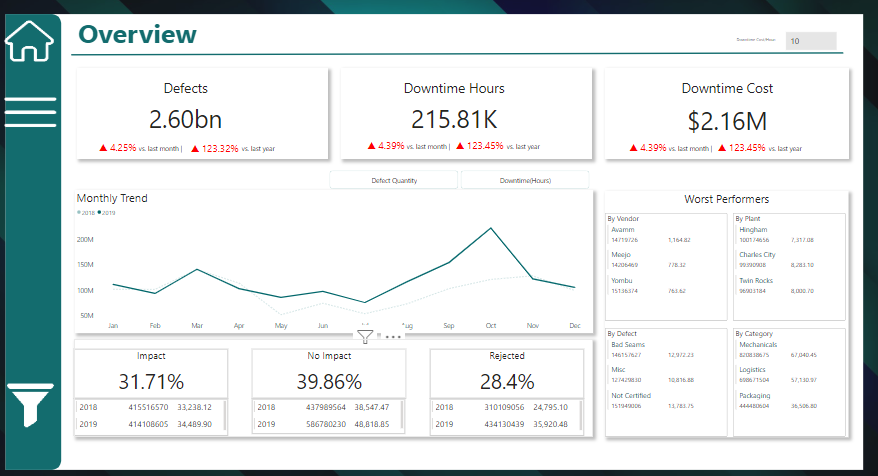

# Project-Portfolio
This Repository will hold all PowerBi Vizualizations for my Portfolio Projects. 
# Supplier Quality and Performance Dashboard
## Overview
This repository contains the Power BI solution for analyzing supplier quality and performance across multiple dimensions such as vendors, plants, materials, and defect types. The dashboard provides a comprehensive view of defects, downtime, and financial impact, allowing manufacturers to identify problem areas and take action to improve supplier quality and reduce operational inefficiencies.

The case study presented here was developed for a manufacturing company facing challenges in tracking and improving supplier performance. Through the use of business intelligence, the company was able to centralize procurement data and generate actionable insights to address issues such as material defects, vendor performance, and production downtime.

Key Features
Defect Tracking: Visualizes defect quantities and types across vendors, materials, and plants.
Downtime Analysis: Shows downtime hours and their financial impact, helping stakeholders understand the cost implications of defective materials.
Worst Performers: Highlights the vendors, plants, and materials contributing the most to defects and downtime.
Trend Analysis: Displays monthly trends for defect quantities and downtime hours, making it easy to identify patterns over time.
Vendor-Material/Plant Combinations: Analyzes specific combinations to reveal high-risk relationships between vendors and plants or materials.
Financial Impact: Quantifies the financial losses due to downtime, enabling data-driven decisions to improve supplier quality.
Data Model
The dashboard was built using a Star Schema data model for optimal performance and ease of analysis. Key dimensions such as vendor, plant, material type, and defect type were separated into individual tables, while a fact table was created for metrics like defect quantity and downtime.

Fact Table: Contains core metrics such as Total Defect Qty and Downtime Hours.
Dimension Tables: Includes Vendor, Plant Location, Material Type, Defect Type, and other related attributes.
Date Table: Supports time-based analysis, making it possible to track trends and filter reports by time periods.

## Reports and Visuals
The dashboard is divided into several key pages, each focusing on a different aspect of supplier quality:

- **Overview**: Displays critical metrics such as total defect quantity, downtime hours, and financial impact.
- **Vendor Performance**: Highlights the best and worst-performing vendors based on defect quantity and downtime.
- **Plant Performance**: Analyzes plant locations to identify the most problematic sites.
- **Material Performance**: Provides a breakdown of defects and downtime by material type.
- **Downtime Impact**: Quantifies downtime costs and shows the highest cost periods.

## Overview 0f The Supplier Quality and Performance Dashboard

